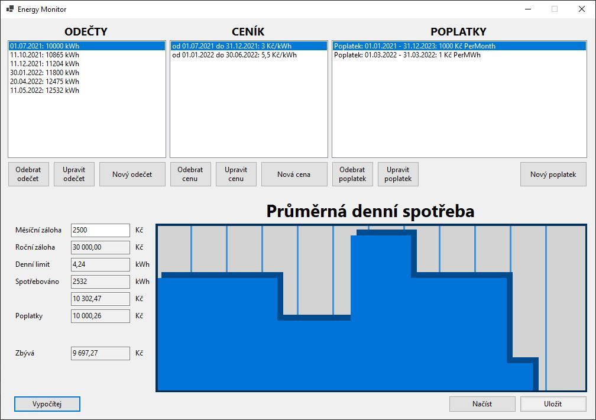
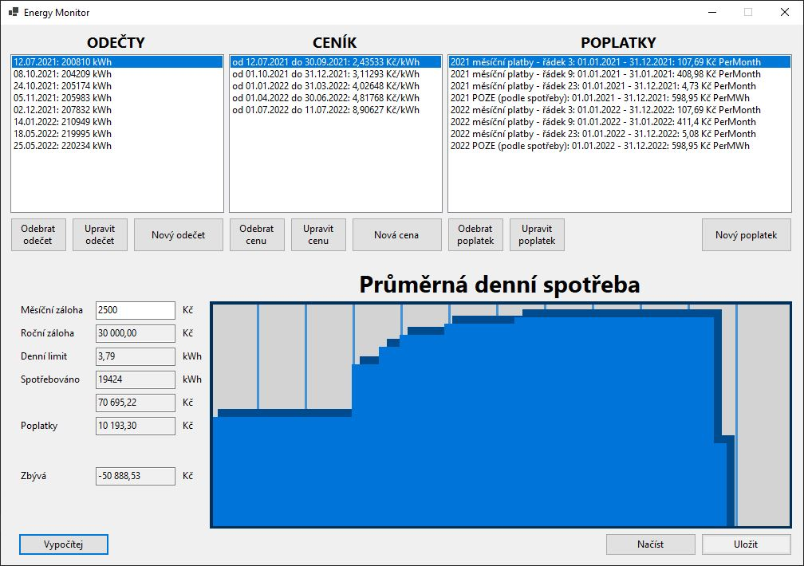
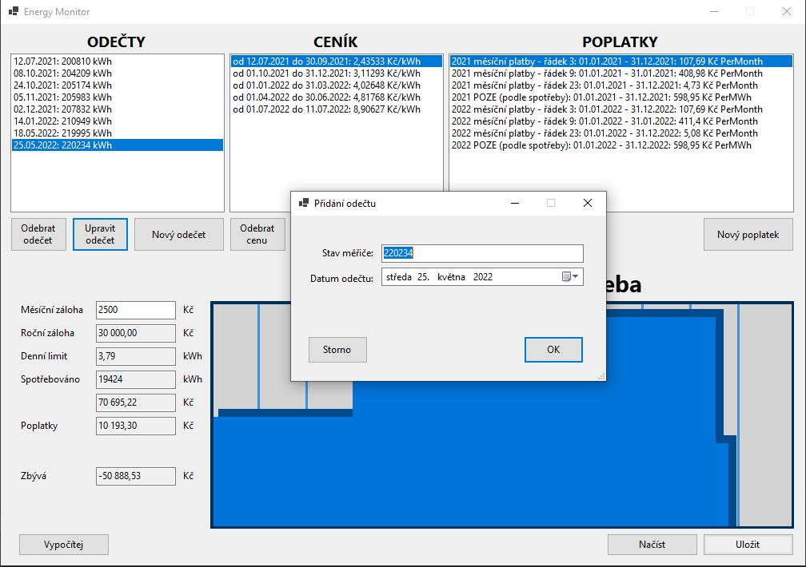

# Energy Monitor

### Zadání:
- práce je realizována s využitím jazyka C# a .NET
- práce nevyužívá externí knihovny (pokud nejsou předem schváleny vyučujícím na základě domluvy)
- aplikace je napsána v souladu s „coding guidelines“ a „naming conventions“ podle jazyka C#
- aplikace disponuje GUI (WinForms, WPF, MAUI), prací se soubory, interakcí s uživatelem
- práce je vypracována samostatně studentem a není založena na cizím kódu

### Zvolené téma - zadání
Jednoduchá databázová aplikace pro specifikované použití (např. kalendář (den, události, poznámky,
upomínky), inventarizační evidence majetku (budovy, místnosti, předměty), organizační aplikace pro pořádání
turnajů (hráči, kola, výsledky), …).
- GUI aplikace s možností zadávat, prohlížet, editovat údaje
- minimálně 3 typy entit (relací) propojené vhodnými relacemi
- data ukládána do souborů nebo pomocí embedded databáze (vizte základní požadavky – externí knihovny);
externí databáze (Oracle, MySQL, MariaDB, Postgres, …) nejsou akceptovány

### Popis aplikace Energy Monitor
Energy Monitor je aplikace, která slouží k ověření spotřeby elektrické energie v průběhu roku mezi vyúčtováními. Každý rok tak trochu překvapení, kolik která domácnost bude doplácet za elektrickou energii. S pomocí této aplikace si uživatel bude moct ověřit, jak na tom je v každém dni v roce.

Aplikace umožňuje:
- Sledovat entity: měření, poplatek, cena 
- Načítat data od uživatele, který provede měření na elektroměru. 
- Vycházet z ročního rozpočtu (12 násobek měsíčních záloh) 
- Odečítat bude všechny povinné poplatky, ty fixní i ty procentuální 
- Umožňovat změnu ceny v průběhu roku 
- Vykreslovat graf letošní spotřeby 
- Spravovat více domácností nezávisle na sobě (nebo např. jen místnosti opatřené měřiči spotřeby) 
- Ukládat a načítat nastavení a data

### IDE
Microsoft Visual Studio Community 2022

### Screenshoty:

